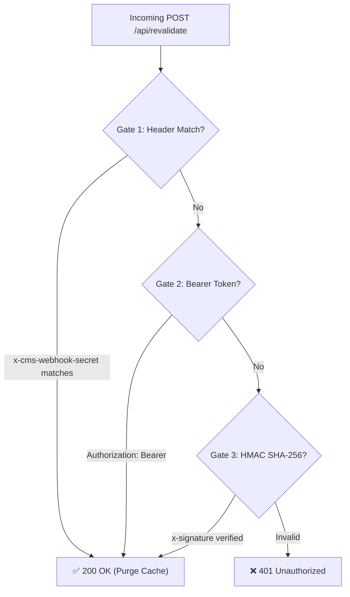

# @jupsoft/next-blog

> Turnkey, self-healing Blog Engine for Next.js 14, 15, and 16 App Router powered by Jupsoft Centralized CMS (Blogary).

[](https://github.com/virajverse/jupsoft-next-blog)
[](https://opensource.org/licenses/MIT)
[](https://nextjs.org/)

---

## ⚡ Key Features & Superpowers

- 🛡️ **Self-Healing CLI (`doctor` & `fix`)**: Automatically scans your project, diagnoses missing or dummy pages, and repairs broken routes in 1 click.
- 🌐 **Live CMS Pre-Flight Test**: Instantly tests connectivity with `https://blogary.jupsoft.com`, verifies tenant credentials, and confirms published blog count.
- 🔒 **Multi-Gate Webhook Security**: Fail-safe on-demand ISR revalidation supporting Direct Header (`x-cms-webhook-secret`), Bearer token, and Cryptographic HMAC SHA-256 with automatic default fallback.
- 🌍 **Automatic Browser Locale Detection**: Detects user preference (`hi`, `fr`, `ar`, `en`) and serves localized content seamlessly.
- 🔍 **Google Search Console Hreflang SEO**: Dynamic multi-language canonical, OpenGraph, and Twitter cards out of the box.
- ⚡ **Instant ISR Cache Purge**: Next.js App Router cache invalidation in under 50ms upon publish/update/archive in the CMS Admin Portal.
- 🎨 **Responsive Micro-Dropdown**: Sleek `[ 🌐 EN ▾ ]` language switcher with zero third-party dependencies.

---

## 🚀 Quickstart: Self-Healing Scaffolder

Run the interactive self-healing CLI inside your Next.js project root:

```bash
# Auto-setup and configure your project
npx @jupsoft/next-blog --site=YOUR_WEBSITE_ID --key=YOUR_API_KEY
```

### 1. The Doctor Command (`doctor`)
Inspect the health of your blog integration, verify environment credentials, and run a live test ping against the CMS backend:

```bash
npx @jupsoft/next-blog doctor
```

**Diagnostic Output:**
```text
=============================================================
🚀 [Blogary CMS] Universal Blog Engine — Doctor & Auto-Fixer
=============================================================
🔍 Inspecting project at: /your-project

  ✔ package.json found (my-website)
  ✔ Next.js App Router project detected (app)
  ✔ app/blog/page.tsx is properly connected to JupsoftBlogList
  ✔ app/blog/[slug]/page.tsx is properly connected to JupsoftBlogDetail
  ✔ app/api/revalidate/route.ts is properly wired for ISR revalidation
  ✔ CMS_WEBSITE_ID configured (site-cloud)
  ✔ CMS_TENANT_API_KEY configured (masked: jup_sec_...)

🌐 Running Live Pre-Flight CMS API Connection Test...
  ✔ Connected to Blogary CMS (https://blogary.jupsoft.com)
  ✔ Tenant Authenticated: site-cloud (Found 5 published blog articles)
    👉 Latest blog: "Getting Started with Cloud ERP" (slug: /blog/getting-started)

=============================================================
✅ AUDIT RESULT: HEALTHY & FULLY OPERATIONAL
=============================================================
```

### 2. The Auto-Fix Command (`fix`)
If someone left a static placeholder (e.g. `"Stories are coming soon"`), routes are missing, or `.env.local` is incomplete, run:

```bash
npx @jupsoft/next-blog fix
```
The CLI will automatically:
1. Replace dummy placeholders with `<JupsoftBlogList />`.
2. Generate `app/blog/[slug]/page.tsx` with dynamic metadata.
3. Wire `app/api/revalidate/route.ts` with multi-gate authentication.
4. Auto-fill missing variables in `.env.local`.

---

## 📦 Manual Installation & Integration

If you prefer wiring routes manually:

```bash
npm install git+https://github.com/virajverse/jupsoft-next-blog.git
# or
npm install @jupsoft/next-blog
```

### 1. Blog Listing Grid (`app/blog/page.tsx`)

```tsx
import { JupsoftBlogList } from '@jupsoft/next-blog';

export const revalidate = 3600;

type BlogListPageProps = {
  searchParams?: Promise<Record<string, string | string[] | undefined>>;
};

export default function BlogPage(props: BlogListPageProps) {
  return (
    <main className="min-h-screen">
      <JupsoftBlogList {...props} />
    </main>
  );
}
```

> **Tip:** You can wrap `<JupsoftBlogList />` inside your website's custom `<Navbar />` and `<Footer />` components to match your brand design perfectly!

---

### 2. Single Article Post (`app/blog/[slug]/page.tsx`)

```tsx
import { JupsoftBlogDetail, generateBlogMeta } from '@jupsoft/next-blog';

type BlogDetailPageProps = {
  params: Promise<{ slug: string }>;
  searchParams?: Promise<Record<string, string | string[] | undefined>>;
};

export const revalidate = 3600;

// Automatic Google SEO & OpenGraph meta tags
export async function generateMetadata(props: BlogDetailPageProps) {
  return generateBlogMeta(props);
}

export default function BlogDetailPage(props: BlogDetailPageProps) {
  return <JupsoftBlogDetail {...props} />;
}
```

---

### 3. 🎨 100% Custom Headless Mode (Zero Vibe Clash — Recommended for Custom Brands)

If your website has a custom design system, luxury aesthetic, dark mode, or unique typography, you don't have to use the pre-built UI components. You can use the **Headless SDK** directly — CMS provides the data, and **YOU control 100% of the UI, styles, fonts, headers, and footers**:

#### Custom Blog Listing (`app/blog/page.tsx`):
```tsx
import Link from 'next/link';
import Image from 'next/image';
import { jupsoft, type BlogPost } from '@jupsoft/next-blog';
import { Navbar } from '@/components/Navbar';
import { Footer } from '@/components/Footer';

export const revalidate = 3600;

export default async function CustomBlogPage() {
  const { data: posts } = await jupsoft.getBlogs({ page: 1, limit: 12 });

  return (
    <div className="min-h-screen bg-slate-900 text-white">
      <Navbar />
      <main className="max-w-7xl mx-auto px-6 py-16">
        <h1 className="text-5xl font-bold font-display">Our Journal</h1>
        <div className="grid grid-cols-1 md:grid-cols-3 gap-8 mt-12">
          {posts.map((post: BlogPost) => (
            <article key={post.id} className="rounded-2xl border border-slate-800 p-6 bg-slate-950/50">
              {post.featuredImage && (
                <div className="relative aspect-video rounded-xl overflow-hidden mb-4">
                  <Image src={post.featuredImage} alt={post.title} fill className="object-cover" />
                </div>
              )}
              <span className="text-xs text-indigo-400 font-semibold">{post.readTimeMinutes} min read</span>
              <h2 className="text-2xl font-bold mt-2 hover:text-indigo-400">
                <Link href={`/blog/${post.slug}`}>{post.title}</Link>
              </h2>
              <p className="text-slate-400 text-sm mt-3 line-clamp-2">{post.excerpt}</p>
            </article>
          ))}
        </div>
      </main>
      <Footer />
    </div>
  );
}
```

#### Custom Article Reader (`app/blog/[slug]/page.tsx`):
```tsx
import { notFound } from 'next/navigation';
import { jupsoft, generateBlogMeta, type BlogPost } from '@jupsoft/next-blog';
import { Navbar } from '@/components/Navbar';
import { Footer } from '@/components/Footer';

type Props = {
  params: Promise<{ slug: string }>;
  searchParams?: Promise<Record<string, string | string[] | undefined>>;
};

export async function generateMetadata(props: Props) {
  return generateBlogMeta(props);
}

export default async function CustomBlogDetail(props: Props) {
  const { slug } = await props.params;
  const post = await jupsoft.getBlogBySlug(slug);

  if (!post) notFound();

  // Record real-time analytics
  jupsoft.recordView(slug, post.id);

  return (
    <div className="min-h-screen bg-slate-900 text-white">
      <Navbar />
      <article className="max-w-4xl mx-auto px-6 py-20">
        <h1 className="text-5xl font-extrabold font-display leading-tight">{post.title}</h1>
        <div className="flex items-center gap-4 text-xs text-slate-400 mt-4 pb-8 border-b border-slate-800">
          <span>By {post.authorName || 'Editorial Team'}</span>
          <span>&middot;</span>
          <span>{post.readTimeMinutes} min read</span>
        </div>
        <div 
          className="prose prose-invert prose-lg max-w-none mt-10"
          dangerouslySetInnerHTML={{ __html: post.content }} 
        />
      </article>
      <Footer />
    </div>
  );
}
```

---

### 4. On-Demand ISR Revalidation Webhook (`app/api/revalidate/route.ts`)

```ts
export { POST } from '@jupsoft/next-blog/webhook';
```

---

## 🔐 Environment Variables (`.env.local`)

Configure the following variables in your local `.env.local` file:

| Variable | Description | Example / Default |
|---|---|---|
| `CMS_API_URL` | Base URL of the Jupsoft Blogary backend | `https://blogary.jupsoft.com` |
| `NEXT_PUBLIC_CMS_API_URL` | Public fallback URL for client widgets | `https://blogary.jupsoft.com` |
| `CMS_WEBSITE_ID` | Your Tenant ID registered in the CMS Admin Portal | `site-cloud` |
| `CMS_TENANT_API_KEY` | Your private tenant API key | `jup_sec_...` |
| `CMS_WEBHOOK_SECRET` | Secret key for webhook revalidation | `wh_sec_jupsoft_default_revalidate_2026` *(Default)* |

> **Note on Zero-Config Webhook Fallback:** If `CMS_WEBHOOK_SECRET` is omitted or undefined in the environment, the SDK automatically falls back to `wh_sec_jupsoft_default_revalidate_2026`. This guarantees that webhook pings from the Admin Portal never fail with `401 Unauthorized`.

---

## ☁️ Deploying to Netlify / Vercel

When deploying to remote hosting platforms like Netlify or Vercel:

1. Open your **Site Dashboard** ➔ **Site configuration** ➔ **Environment variables**.
2. Add the 4 core environment variables:
   - `CMS_API_URL` = `https://blogary.jupsoft.com`
   - `CMS_WEBSITE_ID` = `<your-website-id>`
   - `CMS_TENANT_API_KEY` = `<your-api-key>`
   - `CMS_WEBHOOK_SECRET` = `wh_sec_jupsoft_default_revalidate_2026`
3. ⚠️ **Important for Netlify:** Environment variable changes only take effect on **future deploys**. Go to **Deploys ➔ Trigger deploy ➔ "Clear cache and deploy site"** after setting variables.

---

## 🛡️ Multi-Gate Webhook Architecture

The webhook receiver at `/api/revalidate` implements a resilient 3-Gate Authentication system:



1. **Gate 1 (Direct Secret Header):** Verifies the `x-cms-webhook-secret` header.
2. **Gate 2 (Bearer Header):** Verifies `Authorization: Bearer <secret>`.
3. **Gate 3 (Cryptographic HMAC SHA-256):** Computes HMAC using the target secret (or fallback default) and performs a constant-time comparison against `x-signature: sha256=...`.

---

## 🛠️ Troubleshooting FAQ

### 1. "Blog post published in CMS, but not visible on `/blog`"
- **Cause:** Your `app/blog/page.tsx` file may still be a static dummy placeholder (e.g. `<h1>Stories are coming soon</h1>`) instead of importing `JupsoftBlogList`.
- **Fix:** Run `npx @jupsoft/next-blog fix` to automatically wire the route, or verify the direct slug URL (e.g. `/blog/your-slug`).

### 2. "Webhook returns 401 Unauthorized on Netlify"
- **Cause:** Netlify functions are running an old build from before `CMS_WEBHOOK_SECRET` was saved.
- **Fix:** In Netlify Dashboard, click **Deploys ➔ Trigger deploy ➔ Clear cache and deploy site**.

### 3. "Tenant website 'XYZ' not found (401)"
- **Cause:** The `CMS_WEBSITE_ID` in `.env.local` does not match any active website in the CMS database.
- **Fix:** Run `npx @jupsoft/next-blog doctor` to see the live connectivity test and verify your website ID.

---

## 📄 License
MIT © [Jupsoft Systems](https://jupsoft.com)
